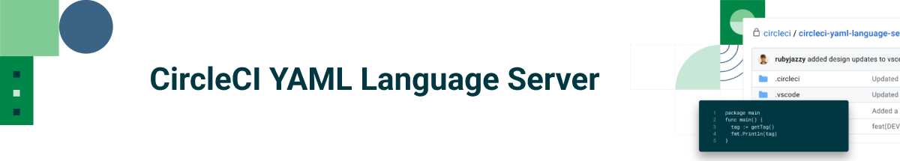
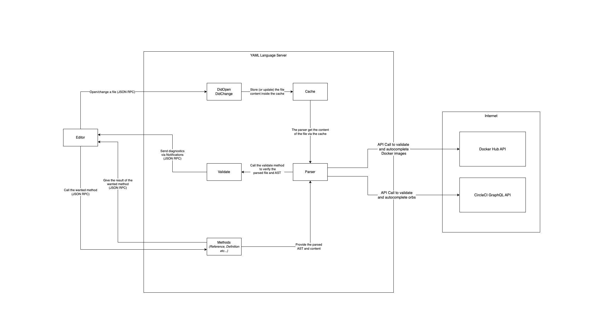

# CircleCI YAML Language Server

## This is CircleCI's YAML Language Server.

The official CircleCI extension for Visual Studio Code is available
[on the VS Code Marketplace](https://marketplace.visualstudio.com/items?itemName=circleci.circleci).
This extension was developed by the Developer Experience team of CircleCI and it
includes two sets of features: the pipeline manager and the config helper.

**The CircleCI config helper is based on a Language Server.** It provides
language support for CircleCI YAML files. Thanks to the new VS Code extension,
developers and DevOps engineers have access to direct feedback about the Config
file they are editing, through features such as syntax validation and
highlighting, rich navigation, on-hover documentation, autocompletion and usage
hints.

In our case the Language Server is an implementation of the Language Server
Protocol for CircleCI YAML config files that we have open sourced in order to
provide more transparency to our community regarding the way the config helper
works under the hood and by providing access for our community to take the
language server capabilities to the IDE of their liking.

We believe that the CircleCI community is best placed to say what features are
truly important or what bugs are the most annoying. We hope that the whole
community will contribute to improving this tool by pointing out or addressing
issues we might have overlooked. And we hope the value of this language server
will be accessible to a great number of CircleCI users regardless of the IDE
they choose to use.

The Language Server is implemented in Go 1.19+ and is, at its core, a JSON-RPC
server that handles different calls (specified by the LSP spec).

## Summary

- [Features](./README.md#features)
- [Platforms, Deployment and Package Managers](./README.md#platforms)
- [Contributing](./README.md#contributing)
- [Architecture Diagram](./README.md#architecture)
- [Code of Conduct](./CODE_OF_CONDUCT.md)
- [Contribution Guidelines](./CONTRIBUTING.md)
- [Contributors](./README.md#contributor)
- [Language clients](./README.md#language-server-clients)
- [Quick Links](./README.md#quicklinks)
- [Credits](./README.md#credits)
- [Hacking](./HACKING.md)
- [License](./README.md#licence)

## Features

<!-- Copied from circleci-vscode-extension/README.md, please keep sync! -->

This project provides in-file assistance to writing, editing and navigating
CircleCI Configuration files. It offers:

- **Rich code navigation through “go-to-definition” and “go-to-reference”
  commands**. This is especially convenient when working on large configuration
  files, to verify the definition of custom jobs, executors parameters, or in
  turn view where any of them are referenced in the file. Assisted code
  navigation also works for Orbs, allowing to explore their definition directly
  in the IDE when using the go-to-definition feature on an orb-defined command
  or parameter.

    

- **Contextual documentation and usage hints when hovering on specific keys**,
  so to avoid you having to continuously switch to your browser to check the
  docs whenever you are editing your configuration. That said, links to the
  official CircleCI documentation are also provided on hover - for easier
  navigation.

    

- **Syntax validation** - which makes it much easier to identify typos,
  incorrect use of parameters, incomplete definitions, wrong types, invalid or
  deprecated machine versions, etc.

    

- **Usage warnings** - which can help identify deprecated parameters, unused
  jobs or executors, or missing keys that prevent you from taking advantage of
  CircleCI’s full capabilities

    

- **Auto completion**, available both on built-in keys and parameters and on
  user-defined variables

    

- **Diagnostic suppression** - allows you to suppress specific warnings and errors using special comments:
  - `# cci-ignore` - suppress diagnostic on the same line
  - `# cci-ignore-next-line` - suppress diagnostic on the next line
  - `# cci-ignore-start` / `# cci-ignore-end` - suppress diagnostics in a range
  - `# cci-ignore-file` - suppress all diagnostics in the file

  Quick-fix code actions are available to automatically insert suppression comments.

    

## Platforms, Deployment and Package Managers

The tool is deployed through
[GitHub Releases](https://github.com/CircleCI-Public/circleci-yaml-language-server/releases).
Green builds on the `main` branch will create a new release PR. These need to be approved and merged manually, and will publish binaries for macOS, Linux and Windows.

Important note: Release-please will only create a release PR for PRs that have a `feat` or `fix` commit message. If your PR starts with `chore` , your changes will NOT be released.

This is a project in active development, and we target a release frequency of
one release per week on average. However, we reserve the right of releasing more
or less frequently when necessary.

## Contributing

Please feel free to contribute to this project, we update our Hall of fame -
[CONTRIBUTORS.md](./CONTRIBUTORS.md) with all contributors who helped us fix a
bug. You can find all the contribution guidelines and useful information in
[CONTRIBUTING.md](./CONTRIBUTING.md). Development instructions for the CircleCI
YAML Language Server can be found in [HACKING.md](HACKING.md).

## Architecture diagram

## Language Server clients

- VSCode:
  [CircleCI VSCode extension](https://marketplace.visualstudio.com/items?itemName=circleci.circleci)
- Neovim: [tomoakley Neovim plugin](https://github.com/tomoakley/circleci.nvim)

If you which to implement a client for your editor, please take a look at
[ADD_A_CLIENT.md](./ADD_A_CLIENT.md)

## Quick links

- [Install the VS Code extension using our language server](https://marketplace.visualstudio.com/items?itemName=circleci.circleci)

- [Discover how the language server was leveraged for the VS Code extension](https://youtu.be/Sdi7ctAXe2A)

- [Learn more about CircleCI](https://circleci.com/)

- [Do you have questions? Ask the circleCI community Discuss](https://discuss.circleci.com/)

## Social media links

Help us get the word out! Share our project.
